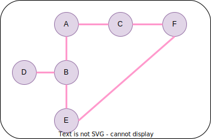

# Documentation

## The figure below describes the graph structure.

### graph = {
###    'A': ['B', 'C'],
###    'B': ['D', 'E'],
###    'C': ['F'],
###    'D': [],
###    'E': ['F'],
###    'F': []
### }

